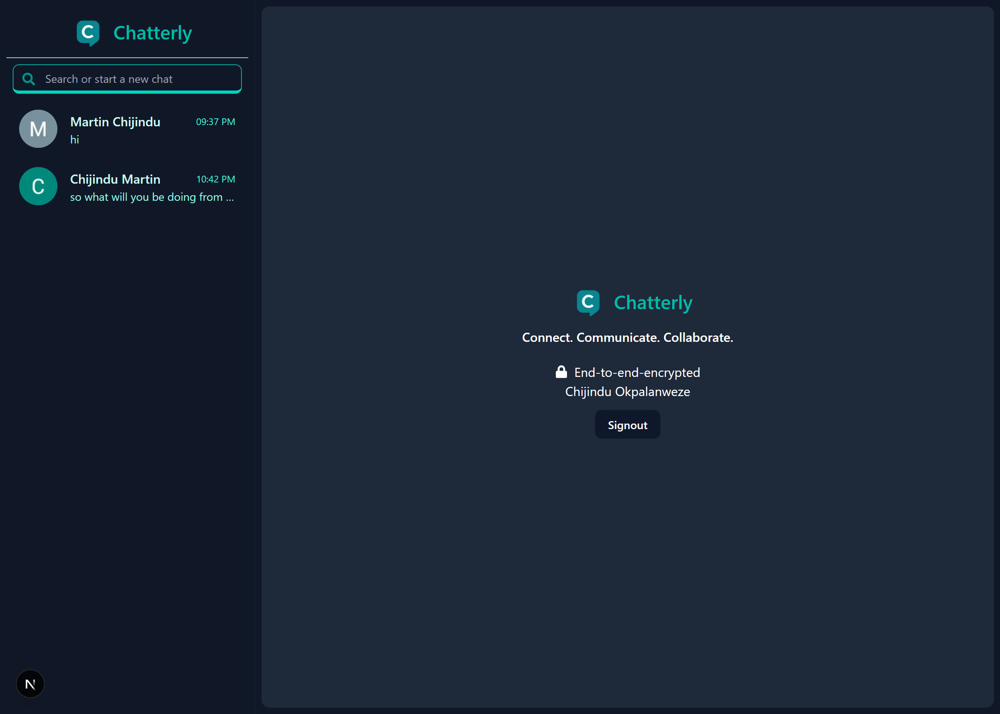

**Chatterly**, built with **Next.js** and **Supabase**:

---

# 💬 Chatterly - Realtime Chat App

Chatterly is a modern, full-stack chat application built with **Next.js** and **Supabase**. It enables users to sign in using **Google authentication** and chat with other users in real-time.



---

## 🚀 Features

- 🔐 Google authentication via Supabase
- 🧑‍🤝‍🧑 View and chat with other users
- 💬 Real-time messaging and online presence with Supabase Realtime and presence
- 📦 Supabase PostgreSQL for data storage
- 🖼️ User avatars (from Google or custom)
- 📱 Responsive UI for all devices

---

## 🛠️ Built With

- [Next.js](https://nextjs.org/) – React framework for building web apps
- [Supabase](https://supabase.com/) – Backend-as-a-service (Auth + DB + Realtime + Presence)
- [Tailwind CSS](https://tailwindcss.com/) – For styling
- [Lucide Icons](https://lucide.dev/) – Clean, beautiful icons

---

## ⚙️ Installation

### 1. Clone the repository

```bash
git clone https://github.com/MartinJindu/chatterly.git
cd chatterly
```

````

### 2. Install dependencies

```bash
npm install
```

### 3. Setup Supabase

- Create an account at [supabase.com](https://supabase.com/)
- Create a new project
- Enable **Google provider** in Authentication
- Create the following tables using SQL in Supabase:

```sql
-- profiles table
create table profiles (
  id uuid primary key references auth.users(id),
  username text,
  full_name text,
  avatar_url text,
  created_at timestamp with time zone default now()
);

-- messages table
create table messages (
  id uuid default uuid_generate_v4() primary key,
  sender_id uuid references profiles(id),
  recipient_id uuid references profiles(id),
  message text not null,
  created_at timestamp with time zone default now()
);
```

- Enable **Row Level Security** and set appropriate policies.

### 4. Add environment variables

Create a `.env.local` file in the root directory and add:

```env
NEXT_PUBLIC_SUPABASE_URL=your-supabase-url
NEXT_PUBLIC_SUPABASE_ANON_KEY=your-anon-key
```

---

## ▶️ Running the App

```bash
npm run dev
```

Visit `http://localhost:3000`

---

## 🧠 Usage

1. Log in using Google
2. View a list of other users
3. Start a chat with any user
4. Messages are sent and received in real-time

---

## ✨ Future Features

- ✅ Typing indicators
- ✅ Chat notifications
- ⏳ Message seen status
- ⏳ Media sharing (images, files)
- ⏳ Group chats

---

## 📄 License

MIT License

---

## 🙌 Acknowledgements

- [Supabase](https://supabase.com/)
- [Next.js](https://nextjs.org/)
- [Tailwind CSS](https://tailwindcss.com/)
````
